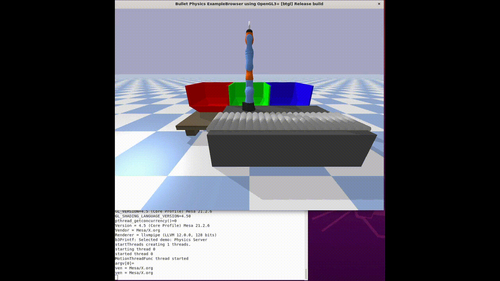

<!-- Improved compatibility of back to top link: See: https://github.com/othneildrew/Best-README-Template/pull/73 -->

<!--
*** Thanks for checking out the Best-README-Template. If you have a suggestion
*** that would make this better, please fork the repo and create a pull request
*** or simply open an issue with the tag "enhancement".
*** Don't forget to give the project a star!
*** Thanks again! Now go create something AMAZING! :D
-->

<!-- PROJECT SHIELDS -->
<!--
*** I'm using markdown "reference style" links for readability.
*** Reference links are enclosed in brackets [ ] instead of parentheses ( ).
*** See the bottom of this document for the declaration of the reference variables
*** for contributors-url, forks-url, etc. This is an optional, concise syntax you may use.
*** https://www.markdownguide.org/basic-syntax/#reference-style-links
-->

<h3 align="center">Control and Planning Algorithms for KUKA Manpiulator in Pick-and-Place Task</h3>

  

    At this project, we are required to use the KUKA IIWA manipulator to perform a pick-and-place task. The task is to pick up a cubes object from a working conveyer and place the cube in the right place based on its color. 
     
     
     
    <a href="https://github.com/Mhm-707/kuka-control-planning/blob/main/ece275_final_presentation.pptx">View Presentation</a>
    
  

## Requirements
- Python 3.7.10
- Numpy 1.19.5
- Pybullet 3.1.7
- ompl 1.5.0
- control 0.9.0
- Pickle 4.0

## Usage

*kuka_dynamics.py* is a python file that contains the code for the dynamics of the KUKA manipulator.\
*kuka_kinematics.py* is a python file that contains the code for the kinematics of the KUKA manipulator.\
*utils.py* is a python file that contains all the functions that are used in the main file.\
*utils2.py* is a python file that contains all the functions that are used for the planning part in the main file.\
*kuka_term_project_final.py* is the main file that contains the code for the project.\
*prm_generation.py* is a python file that contains the code for the PRM generation.\
*prm_planning.py* is a python file that contains the code for the PRM planning. \
*planner_data.pickle* is a pickle file that contains the data for the PRM planning with path length as objective to optimize.\
*planner_data_path_clearance.pickle* is a pickle file that contains the data for the PRM planning with path clearance as objectives to optimize.

To run the code, you need to run the main file *kuka_term_project_final.py* .

(<a href="#readme-top">back to top</a>)

<!-- CONTACT -->
## Contact

Mohammed Abugurain - Mohammed.Abugurain@gmail.com

Project Link: [https://github.com/Mhm-707/kuka-control-planning/](https://github.com/Mhm-707/kuka-control-planning)

(<a href="#readme-top">back to top</a>)

<!-- MARKDOWN LINKS & IMAGES -->
<!-- https://www.markdownguide.org/basic-syntax/#reference-style-links -->
[contributors-shield]: https://img.shields.io/github/contributors/github_username/repo_name.svg?style=for-the-badge
[contributors-url]: https://github.com/github_username/repo_name/graphs/contributors
[forks-shield]: https://img.shields.io/github/forks/github_username/repo_name.svg?style=for-the-badge
[forks-url]: https://github.com/github_username/repo_name/network/members
[stars-shield]: https://img.shields.io/github/stars/github_username/repo_name.svg?style=for-the-badge
[stars-url]: https://github.com/github_username/repo_name/stargazers
[issues-shield]: https://img.shields.io/github/issues/github_username/repo_name.svg?style=for-the-badge
[issues-url]: https://github.com/github_username/repo_name/issues
[license-shield]: https://img.shields.io/github/license/github_username/repo_name.svg?style=for-the-badge
[license-url]: https://github.com/github_username/repo_name/blob/master/LICENSE.txt
[linkedin-shield]: https://img.shields.io/badge/-LinkedIn-black.svg?style=for-the-badge&logo=linkedin&colorB=555
[linkedin-url]: https://linkedin.com/in/linkedin_username
[product-screenshot]: images/screenshot.png
[Next.js]: https://img.shields.io/badge/next.js-000000?style=for-the-badge&logo=nextdotjs&logoColor=white
[Next-url]: https://nextjs.org/
[React.js]: https://img.shields.io/badge/React-20232A?style=for-the-badge&logo=react&logoColor=61DAFB
[React-url]: https://reactjs.org/
[Vue.js]: https://img.shields.io/badge/Vue.js-35495E?style=for-the-badge&logo=vuedotjs&logoColor=4FC08D
[Vue-url]: https://vuejs.org/
[Angular.io]: https://img.shields.io/badge/Angular-DD0031?style=for-the-badge&logo=angular&logoColor=white
[Angular-url]: https://angular.io/
[Svelte.dev]: https://img.shields.io/badge/Svelte-4A4A55?style=for-the-badge&logo=svelte&logoColor=FF3E00
[Svelte-url]: https://svelte.dev/
[Laravel.com]: https://img.shields.io/badge/Laravel-FF2D20?style=for-the-badge&logo=laravel&logoColor=white
[Laravel-url]: https://laravel.com
[Bootstrap.com]: https://img.shields.io/badge/Bootstrap-563D7C?style=for-the-badge&logo=bootstrap&logoColor=white
[Bootstrap-url]: https://getbootstrap.com
[JQuery.com]: https://img.shields.io/badge/jQuery-0769AD?style=for-the-badge&logo=jquery&logoColor=white
[JQuery-url]: https://jquery.com 
